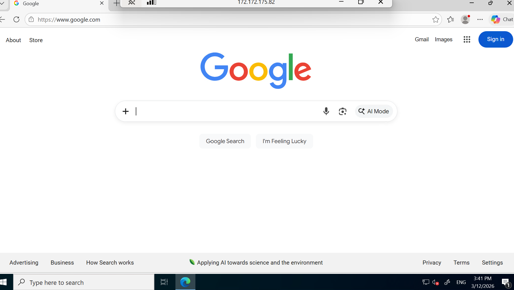
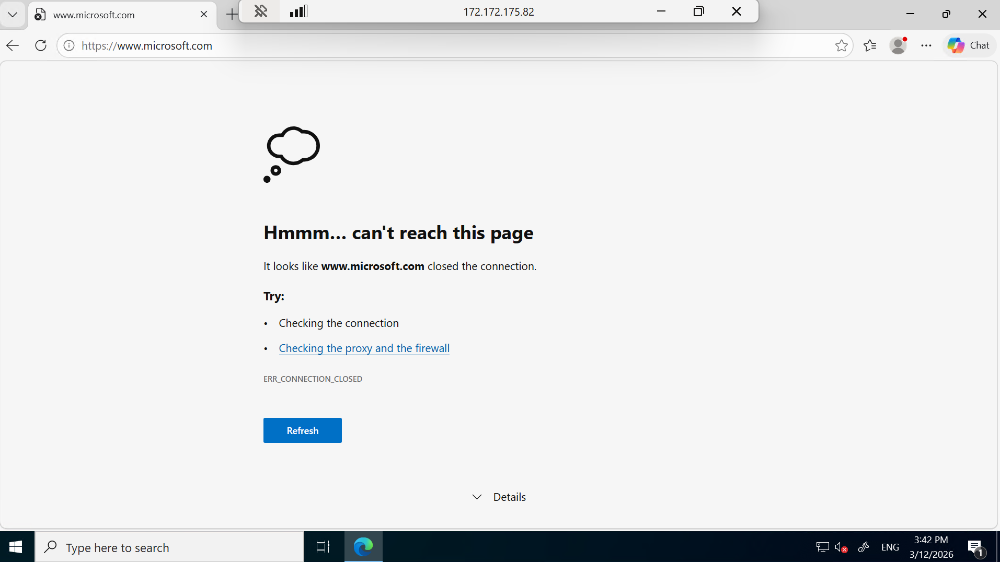

# Labb 08: Azure Firewall  

I den här labben har jag implementerat **Azure Firewall** för att centralisera nätverkssäkerheten. Målet var att skapa en miljö där all trafik ut mot internet kontrolleras strikt genom policies, istället för att bara lita på enkla nätverksregler.

 **Snabbfakta:**
 * **Mål:** Begränsa internetåtkomst till specifika domäner (FQDN).
 * **Huvudteknik:** Azure Firewall (Basic SKU), Firewall Policy, Route Tables (UDR).
 * **Resultat:** En "Default Deny"-miljö där endast godkända sidor går att nå.

---

###  Centrala Koncept

#### Vad är Azure Firewall?
Det är en intelligent, molnbaserad brandväggstjänst som skyddar dina resurser i Azure. Den största fördelen är att den är **Fully Stateful**. 

**Pizzabuds-analogin (Stateful vs Stateless):** 
Tänk dig att du bor i ett lägenhetshus med en receptionist:
* **Stateful (Azure Firewall):** Du säger till receptionisten: *"Jag har beställt pizza, släpp in budet"*. Receptionisten loggar detta: *"Lägenhet 12 har beställt mat"*. När budet kommer tittar hen i boken, ser din beställning och släpper in budet direkt. Hen **minns** sammanhanget.
* **Stateless (NSG):** Receptionisten har inget minne. Varje gång någon knackar på dörren måste hen ha en specifik regel för att släppa in dem, oavsett om du precis pratat med dem eller inte. Det blir krångligt och osäkert.

#### Vad är Azure Policy?
Det är molnets **ordningsvakt**. Den ser till att alla resurser följer de regler och säkerhetskrav som företaget har bestämt. Om en resurs bryter mot reglerna kan den stoppas eller markeras som **"out of compliance"**.

---

###  Genomförande

#### 1. Infrastruktur & Nätverk
Jag satte upp ett virtuellt nätverk med specifika subnät:
* **AzureFirewallSubnet:** Här bor brandväggen.
* **Firewall Management:** Konfigurerat för *Forced Tunneling*.
* **Workload-SN:** Här placerades min test-VM (`Srv-Workload`).

#### 2. Konfiguration av regler (Firewall Policy)
Jag skapade en central policy med följande regler:
* **Application Rules:** Använde **FQDN** (Full Qualified Domain Name) för att tillåta trafik till `www.google.com`.
* **Network Rules:** Tillät DNS-trafik (UDP 53) så att servern kan hitta hemsidor.
* **DNAT Rules:** Gjorde det möjligt att ansluta säkert till servern via brandväggens publika IP (Port forwarding).

#### 3. Route Table (UDR) 
För att tvinga trafiken genom brandväggen skapade jag en **Route Table**. Jag ställde in en route för `0.0.0.0/0` (all trafik) med brandväggens privata IP som **Next hop**.

---

###  Resultat & Verifiering

Efter att ha anslutit till min VM testade jag brandväggens filter i praktiken:

1. **Google.com (Tillåten):** Fungerade klockrent eftersom domänen fanns i min "Allow-list".

2. **Microsoft.com (Blockerad):** Blockerades omedelbart. Eftersom brandväggen nekar allt som inte är tillåtet (**Implicit Deny**), kommer man inte åt några andra sidor.

---

###  Reflektion
Den här labben visade skillnaden i att flytta säkerheten till en centraliserad brandvägg. Att kunna styra trafik baserat på domännamn istället för bara IP-adresser gör hanteringen både säkrare och enklare att skala upp i takt med att infrastrukturen växer.
